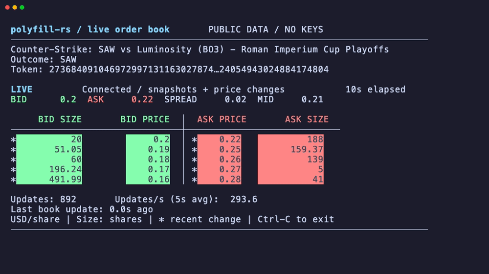

[](https://crates.io/crates/polyfill-rs)
[](https://docs.rs/polyfill-rs)
[](#license)

A high-performance Polymarket Rust client with latency-optimized data structures and allocator-conscious hot paths. The `0.4.x` line is V2-native and intentionally breaking for authenticated trading flows.

At the time that this project was started, `polymarket-rs-client` was a Polymarket Rust Client with a few GitHub stars, but which seemed to be unmaintained. I took on the task of creating a Rust client which could beat the benchmarks quoted in the README.md of that project, with the added constraint of also maintaining zero alloc hot paths.

I also want to take a moment to clarify what zero-alloc means because I've now recieved double digit messages about this on twitter/x and telegram. In this repository the strict claim is limited to tested, warmed hot paths: existing-level book updates and selected read-side calculations are covered by no-heap-traffic tests that count allocations, reallocations, and deallocations. Snapshot churn, first-seen books, and new price levels can still touch the allocator by design.

Notably order book paths that can touch the allocator by design:
- First time seeing a token/book (HashMap insert + key clone): `src/book.rs`
- New price levels when a sorted side needs to grow: `src/book.rs`
- Book removal/drop paths that release owned buffers: `src/book.rs`


## Live Demo



```sh
cargo run --release --locked --example orderbook
```

## Quick Start

Add to your `Cargo.toml`:

```toml
[dependencies]
polyfill-rs = "0.4.0"
```

Replace your imports:

```rust
// Before: use polymarket_rs_client::{ClobClient, Side, OrderType};
use polyfill_rs::{ClobClient, Side, OrderType};

#[tokio::main]
async fn main() -> Result<(), Box<dyn std::error::Error>> {
    let client = ClobClient::new("https://clob.polymarket.com");
    let markets = client.get_sampling_markets(None).await?;
    println!("Found {} markets", markets.data.len());
    Ok(())
}
```

## Performance Comparison

**Real-World API Performance (with network I/O)**

Real-world Polymarket API latency broken down by request phase:


| Operation | Metric | polyfill-rs | rs-clob-client-v2 | polymarket-rs-client | Official Python Client |
|-----------|--------|-------------|-------------------|----------------------|------------------------|
| **Fetch Markets** | mean ± sd | **321.6 ms ± 92.9 ms** | - | 409.3 ms ± 137.6 ms | 1.366 s ± 0.048 s |
| **Cold Start** | single run | 759.3 ms | **568.0 ms** | - | - |
| **Warm Connection** | single run | **153.0 ms** | 191.9 ms | - | - |
| **Steady Typed Total** | p50 / p95 / p99 | **228.2 / 509.9 / 611.2 ms** | 242.3 / 514.2 / 641.3 ms | - | - |
| **Network-Only Byte Fetch*** | p50 / p95 / p99 | 200.0 / **327.3 / 518.6 ms** | **123.3** / 456.9 / 867.2 ms | - | - |
| **CPU Parse Only** | p50 / p95 / p99 | **0.5 / 1.1 / 1.3 ms** | 1.3 / 1.6 / 1.7 ms | - | - |


**Performance vs polymarket-rs-client:**
- **21.4% faster** 
- **32.5% more consistent** 
- **4.2x faster** than Official Python Client

**Benchmark Methodology:** The `rs-clob-client-v2` comparison separates cold start, warm connection, steady-state typed requests, network-only byte fetches, and CPU-only parsing. The latest local live-network run was on June 22, 2026 against `https://clob.polymarket.com/simplified-markets?next_cursor=MA==`. Steady-state rows use 40 paired iterations with alternating order and 100ms delay after 5 warmups; parse rows use 300 iterations from a cached 480KB payload. The network-only row is a selected raw HTTP diagnostic, not a typed SDK method result: it compares polyfill's actual HTTP client with a reqwest client using the `rs-clob-client-v2` default headers and no typed deserialization. The benchmark now prints a full network-only transport matrix covering default reqwest, `rs-clob-client-v2` headers, polyfill's actual client, and polyfill-tuned header variants. The CPU parse row compares polyfill's SIMD-backed typed parser against the `rs-clob-client-v2` request-helper parse path; direct serde parsing of the SDK response type measured 0.5 / 0.6 / 0.6 ms. Run it with `cargo run --release --example official_client_side_by_side_benchmark --features official-client-benchmark`. See `examples/side_by_side_benchmark.rs` in commit `a63a170`: https://github.com/floor-licker/polyfill-rs/blob/a63a170/examples/side_by_side_benchmark.rs for the original legacy benchmark implementation.

**Computational Performance (pure CPU, no I/O)**

| Operation | Performance | Notes |
|-----------|-------------|-------|
| **Order Book Updates (1000 ops)** | 69.6 µs | ~14.4M updates/sec, no allocator traffic for warmed existing-level paths |
| **Spread/Mid Calculations** | 26.6 ns | best bid/ask + spread + mid over sorted-vector book sides |
| **JSON Parsing (480KB)** | ~0.5 ms | SIMD-backed parsing for large REST market responses and benchmarked polyfill typed parse path |
| **WS `book` hot path (decode + apply)** | ~0.24 µs / 1.56 µs / 5.92 µs | 1 / 16 / 64 levels-per-side, strict fixed-point tape parser with generation-marked snapshot retention (see `benches/ws_hot_path.rs`) |

Run the WS hot-path benchmark locally with `cargo bench --bench ws_hot_path`.

**Live submit-path comparison:** run `cargo run --release --example live_submit_path_benchmark --features official-client-benchmark` with `POLYMARKET_PRIVATE_KEY` set. The setup phase derives API credentials by default; set `POLYMARKET_BENCH_DERIVE_API_CREDS=false` to use `POLYMARKET_API_KEY`, `POLYMARKET_API_SECRET`/`POLYMARKET_SECRET`, and `POLYMARKET_API_PASSPHRASE`/`POLYMARKET_PASSPHRASE` from the environment instead. By default this only runs safe authenticated live reads against Polymarket for `polyfill-rs` and `rs-clob-client-v2`. Actual live order posting is intentionally disabled unless `POLYMARKET_BENCH_LIVE_POST_ORDER=1` is set; if `POLYMARKET_BENCH_TOKEN_ID` is omitted, the benchmark selects an active token with midpoint at least `POLYMARKET_BENCH_MIN_MIDPOINT` and resolves that token's tick-size/neg-risk config before timing. Successful orders are canceled immediately after timing is recorded.

**Parsing paths:** `polyfill-rs` keeps two parsing layers on purpose. The allocation-sensitive WS `book` path uses `WsBookUpdateProcessor` in `src/ws_hot_path.rs`, which walks a reusable `simd-json` tape and applies fixed-point book levels directly. The generic stream parser in `src/decode.rs` is an ergonomic compatibility path: it parses through `serde_json::Value` so it can tolerate batches, unknown event types, and mixed message shapes. Likewise, several generic numeric/decimal deserializers in `src/decode.rs` accept string-or-number API fields through `serde_json::Value`; they are not the zero-allocation hot path.

**WebSocket snapshot ordering:** Polymarket `book` messages expose a millisecond `timestamp` and optional `hash`, but no monotonic server sequence/version. The book applier treats newer timestamps as newer, rejects older timestamps, suppresses exact same-timestamp/same-hash duplicates, and accepts same-timestamp/different-hash snapshots in websocket arrival order. The hash distinguishes duplicate vs distinct state; it is not a logical ordering key.

**Key Performance Optimizations:**

The 21.4% performance improvement comes from HTTP/2 tuning with 512KB stream windows optimized for 469KB payloads, explicit Polymarket request headers, SIMD-backed parsing where the client uses the typed fast-response helper for large REST market responses, and opt-in connection prewarming/keep-alive support.

### Memory Architecture

Configurable book depth limiting prevents memory bloat. Hot data structures group frequently-accessed fields for cache line efficiency. Allocation-sensitive hot paths are covered by targeted no-heap-traffic tests where the implementation currently avoids allocation, reallocation, and deallocation.

### Architectural Principles

Price data converts to fixed-point at ingress boundaries while maintaining tick-aligned precision. The critical path uses integer arithmetic with branchless operations. Data converts back to IEEE 754 at egress for API compatibility. This enables deterministic execution with predictable instruction counts.

### Measured Network Improvements

| Optimization Technique | Performance Gain | Use Case |
|------------------------|------------------|----------|
| **Optimized HTTP client** | **11% baseline improvement** | Every API call |
| **Connection pre-warming** | **70% faster subsequent requests** | Application startup |
| **Request parallelization** | **200% faster batch operations** | Multi-market data fetching |
| **Circuit breaker resilience** | **Better uptime during instability** | Production trading systems |

## License

Licensed under either the [Apache License, Version 2.0](LICENSE-APACHE) or the
[MIT license](LICENSE-MIT), at your option.
